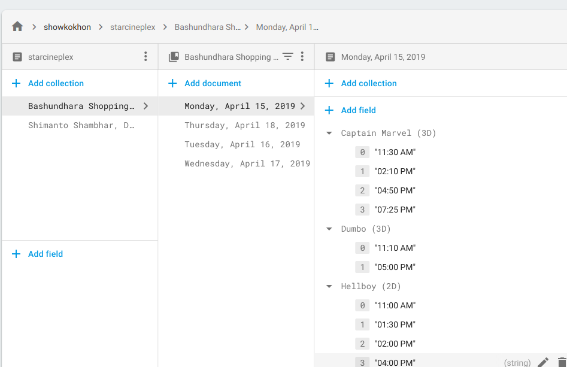

# star-cinplex-scraper
> Web scraping and selenium vodoo magic.

Scraps movie show times from Star Cineplex website and pushes them to a CloudFireStore Database.


## Dev
*Make sure to have JDK 11 and Firefox/Chrome installed on your machine.*
__Also check if the star cineplex website is up or not. That's one horrendous website I must say.__ After these, follow along :

### Init Database
I've used Firebase CloudFireStore here. Why? Because updates should be realtime.

- Create a firebase account.
- Create a project.
- Then download your service account credentials from your project settings.
- Create a directory named `db_secret` inside `src/main/resources` and copy the credentials `json` file there.
- Rename the file to `db.json`.

Now to building!

#### The hard way
- Install gradle
- Clone the repo
- `cd` into the directory
- Run the following into your command line.

```bash
./gradlew clean fatJar

# or, run the script

sudo chmod +x run.sh
./run.sh
```

#### The easy way
Use an IDE. Intellij IDEA preferable.

## Screenshot from Database


## Known Issues
Star cineplex website can get unresponsive at times and that'll make your web driver spit up a lot of `stackTrace`. Simply try again.


## License
MIT
